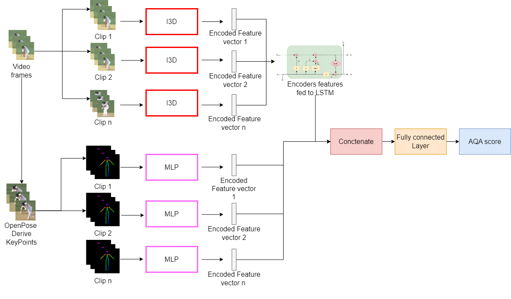

## uj-aqa-cricketvision

Link to paper: [I3D-AE-LSTM: A 2-Stream Autoencoder for Action Quality Assessment using a Newly Created Cricket Batsman Video Dataset](https://openaccess.thecvf.com/content/WACV2025/html/Moodley_I3D-AE-LSTM_A_2-Stream_Autoencoder_for_Action_Quality_Assessment_using_a_WACV_2025_paper.html)

I3D-AE-LSTM Concept

This research introduces CricketVision, a dataset comprising 8,540 video clips of cricket strokes, each annotated with detailed phase breakdowns. We develop a novel approach for Action Quality Assessment (AQA) at a body level that leverages an Autoencoder for extracting sophisticated feature representations from video frames and pose estimated keypoints. These features are subsequently utilised by a multi-layer perception regression-based model to accurately predict the quality of cricket actions in terms of their head, shoulder, hands, hips, and feet. Our approach is benchmarked against contemporary state-of-the-art AQA methods and achieves a Spearman Rank Correlation score of 0.84. The performance highlights the significance of integrating pose keypoint and frame data for the nuanced analysis of short and complex action sequences in sports such as cricket. This work aims to foster the development of accurate Action Quality Assessment methods on Cricket Video data.

## Citations
This repository contains the CricketVison dataset + code introduced in the above paper. If you find this dataset or code useful, please cite the following paper:

@InProceedings{Moodley_2025_WACV,
    author    = {Moodley, Tevin and van der Haar, Dustin Terence},
    title     = {I3D-AE-LSTM: A 2-Stream Autoencoder for Action Quality Assessment using a Newly Created Cricket Batsman Video Dataset},
    booktitle = {Proceedings of the Winter Conference on Applications of Computer Vision (WACV)},
    month     = {February},
    year      = {2025},
    pages     = {5470-5478}
}

## Other Relevant Work
[Cricket Stroke Recognition Using Computer Vision Methods](https://link.springer.com/chapter/10.1007/978-981-15-1465-4_18)

[Automated recognition of the cricket batting backlift technique in video footage using deep learning architectures](https://www.nature.com/articles/s41598-022-05966-6)

[Scene Recognition Using AlexNet to Recognize Significant Events Within Cricket Game Footage](https://link.springer.com/chapter/10.1007/978-3-030-59006-2_9)

[CASRM: Cricket Automation and Stroke Recognition Model Using OpenPose](https://link.springer.com/chapter/10.1007/978-3-030-49904-4_5)

[CASA: Cricket Action Similarity Assessment in Video Footage Using Deep Metric Learning](https://link.springer.com/chapter/10.1007/978-3-031-22321-1_10)

